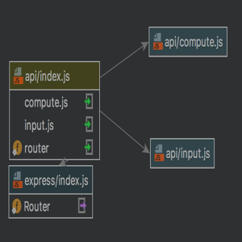
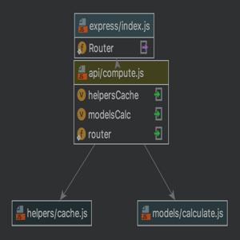

# Merchant Galaxy Calculator - API

Accepts input of different galaxy currency and computes the value based on how it was defined.
    See [GalaxyStory.md](https://github.com/dennisjade/merchant-galaxy-calculator.git/galaxystory.txt)

> *Value* input should follow the format below
* **<item>** is **<valid roman numeral>**
i.e *glob is X*
> *Credit* input should follow the format below
* **<item>++** is **<amount>** credits
i.e. *glob glob Silver is 34 Credits*
> *How many* question input should follow the format below
* how many credits is **<item>++** ?
    i.e. *glob glob Silver is 34 Credits ?*
> *How much* question input should follow the format below
* how much is **<item>++** ?
    i.e. *how much is glob glob Silver ?*

**Legend:**
**++** = You can add as many <item> separated by space

### Installation
Pre-requisites
- [Node](https://nodejs.org) >= 4
- [NPM](https://www.npmjs.com/)
- [Mocha](https://mochajs.org/) ~
#### Setup
```sh
$ git clone https://github.com/dennisjade/merchant-galaxy-calculator.git
$ cd merchant-galaxy-calculator
$ npm install
$ npm start
```

### Test
```sh
$ npm test
```

## Module Diagram




## Sample cache data stored for computation


### APIs
|Method | Route | Params | Description |
|-------|-------|--------|-------------|
|GET    | /api/input | NONE |Returns the cache data object|
|POST   | /api/input | input <string> | Add value assignment to the cache obj|
|DELETE | /api/input | NONE |Clear the cache obj|
|GET    | /api/compute| question <string>|Computes and returns the value

