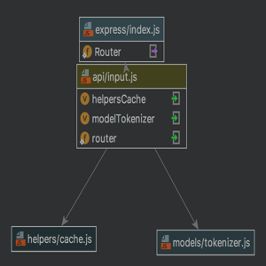

# Merchant Galaxy Calculator - API

Accepts input of different galaxy currency and computes the value based on how it was defined.
    See [GalaxyStory.md](https://github.com/dennisjade/merchant-galaxy-calculator.git/galaxystory.md)

### Installation
Pre-requisites
- [Node](https://nodejs.org) >= 4
- [Mocha](https://mochajs.org/) ~
#### Steps
```sh
$ git clone https://github.com/dennisjade/merchant-galaxy-calculator.git
$ cd merchant-galaxy-calculator
$ npm install
$ node start
```

### Test
```sh
$ npm test
```

## Module Diagram




### APIs
|Method | Route | Params | Description |
|-------|-------|--------|-------------|
|GET    | /api/input | NONE |Returns the cache data object|
|POST   | /api/input | input<string> | Add value assignment to the cache obj|
|DELETE | /api/input | NONE |Clear the cache obj|
|GET    | /api/compute| question<string>|Computes and returns the value

